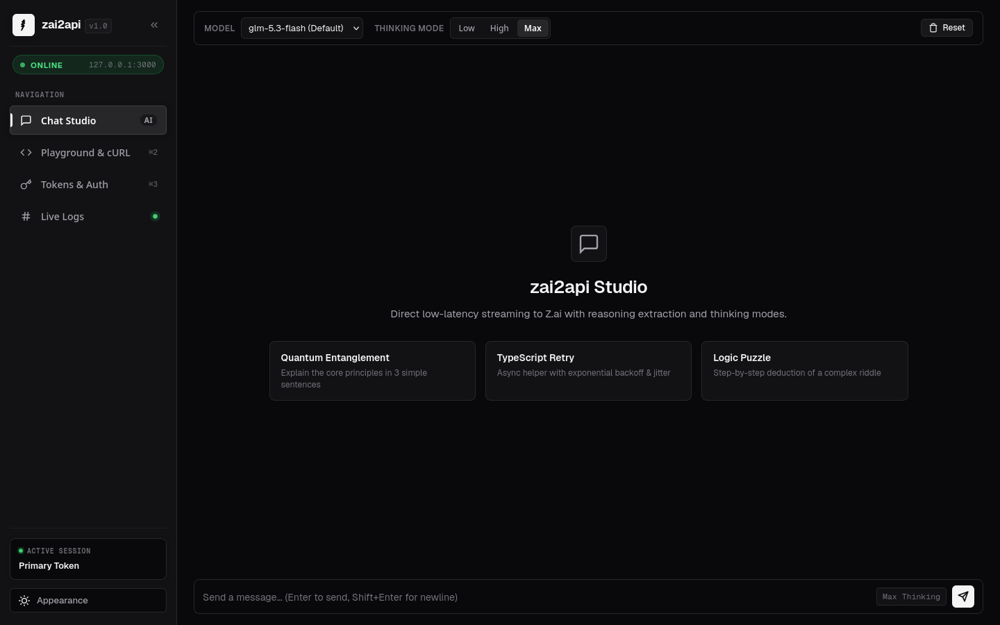
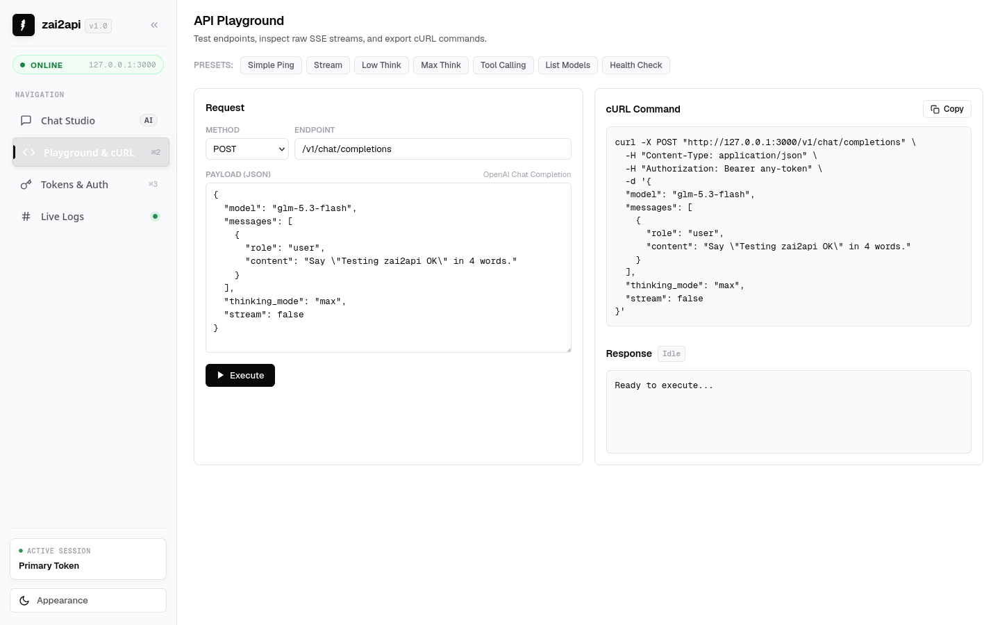
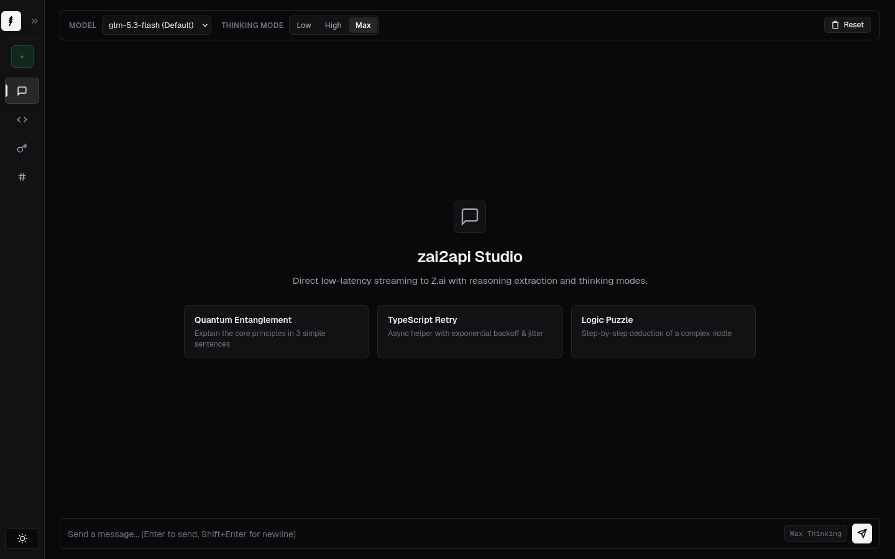
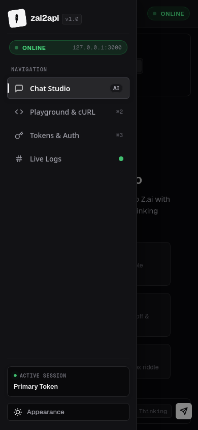

# zai2api

[](https://github.com/bchhngsaygez/zai2api)
[](https://nodejs.org)
[](https://github.com/bchhngsaygez/zai2api)
[](https://github.com/bchhngsaygez/zai2api)
[](LICENSE)

OpenAI-compatible API proxy for Z.ai (GLM-5.3-Flash / GLM-5.3) web chat. Designed for coding assistants (Cline, Roo Code, Cursor), featuring stealth browser automation, robust tool calling, low RAM usage, and instant public tunneling.

<p align="center">
  
</p>

---

## DISCLAIMER

> **IMPORTANT**:
> - This project is an independent open-source tool developed **strictly for educational, personal research, and interoperability purposes**.
> - It is **not affiliated with, endorsed by, maintained, or sponsored by Zhipu AI, Z.ai, or any of their subsidiaries**.
> - This software automates interaction with web interfaces. Users are solely responsible for complying with the third-party provider's Terms of Service, Acceptable Use Policies, and rate limits.
> - The maintainers assume no liability or responsibility for account suspensions, rate limits, service disruptions, or any damages arising from the use or misuse of this software.
> - Provided AS-IS without warranty of any kind. Use responsibly and at your own risk.

---

## Features

- **OpenAI Compatible**: Drop-in replacement for `/v1/chat/completions` with streaming (`stream: true`), function calling, and reasoning content (`thinking_mode`).
- **Coding Agent Ready**: Custom JSON repair and multi-format parser (JSON/XML) handles file creation (`editor`, `write_to_file`), bash execution, and diffs without hallucinations.
- **Guest Mode & Token Rotator**: Works out-of-the-box in free Guest Mode without an account, or add multiple JWT tokens with auto-rotation.
- **Camoufox Stealth Engine**: Built on Firefox-based Camoufox to bypass Alibaba WAF and Cloudflare without Chromium bloat.
- **RAM Optimized**: Single-process mode, 16MB cache limit, zero back-forward cache, and image blocking to stay under 1GB RAM.
- **Studio Dashboard**: Web UI on port 3000 with animated collapsible sidebar, dark/light themes, live SSE terminal logs, and cURL playground.
- **Public Tunneling**: Expose your local proxy to the internet via Cloudflare Tunnel (`npm run tunnel`).
- **Docker Support**: Pre-configured `Dockerfile` and `docker-compose.yml`.

---

## Quick Start

### 1. Requirements & Install

Requires **Node.js 22+**:

```bash
git clone https://github.com/bchhngsaygez/zai2api.git
cd zai2api
npm install
```

### 2. Configure Environment

```bash
cp .env.example .env
```

Key options in `.env`:
```env
PORT=3000
HOST=127.0.0.1
DEFAULT_MODEL=glm-5.3-flash
HEADLESS=true
OPTIMIZE_RAM=true
BLOCK_IMAGES=true
ZAI_AUTH_TOKEN=
```

> If `ZAI_AUTH_TOKEN` is left empty, the server defaults to free Guest Mode automatically.

### 3. Run Server

```bash
npm start
```

Open `http://127.0.0.1:3000` to access the web studio.

---

## Web Studio Dashboard

Available at `http://127.0.0.1:3000`:

| Chat Studio (Dark) | API Playground (Light) |
| :---: | :---: |
|  |  |

| Collapsed Compact Rail (72px) | Mobile Drawer Navigation |
| :---: | :---: |
|  |  |

- **Chat Studio**: Direct streaming chat with thinking mode toggles (`low`, `high`, `max`) and expandable thought processes.
- **Playground & cURL**: Interactive endpoint tester with one-click presets and cURL command export.
- **Tokens & Auth**: Manage multiple Z.ai accounts, test session health, or switch to Guest Mode.
- **Live Logs**: Real-time server terminal streaming stdout events via SSE.
- **Collapsible Sidebar**: Compact 72px icon mode on desktop, responsive slide-out drawer on mobile.
- **Shortcuts**: `Alt+1` (Chat), `Alt+2` (Playground), `Alt+3` (Tokens), `Alt+4` (Logs).

---

## Client Setup

### Cline (VS Code Extension)

- **API Provider**: `OpenAI Compatible`
- **Base URL**: `http://127.0.0.1:3000/v1`
- **API Key**: `sk-zai2api` (or any string)
- **Model ID**: `glm-5.3-flash`
- **Enable Streaming**: Checked

### Cursor

- **Settings** -> **Models** -> **OpenAI API Key** -> Override Base URL: `http://127.0.0.1:3000/v1`
- **Model Name**: `glm-5.3-flash`

### Python SDK

```python
from openai import OpenAI

client = OpenAI(
    base_url="http://127.0.0.1:3000/v1",
    api_key="sk-zai2api"
)

response = client.chat.completions.create(
    model="glm-5.3-flash",
    messages=[{"role": "user", "content": "Hello!"}],
    stream=True
)

for chunk in response:
    print(chunk.choices[0].delta.content or "", end="", flush=True)
```

---

## Public Tunnel (Remote Access)

Expose the proxy to the internet using Cloudflare Tunnel:

```bash
npm run tunnel
```

Cloudflare generates a secure HTTPS URL (e.g. `https://xxx.trycloudflare.com`). Use `https://xxx.trycloudflare.com/v1` as the Base URL in Cline, Cursor, or remote agents.

---

## Docker

Run in the background:
```bash
docker compose up -d --build
```

View logs:
```bash
docker compose logs -f
```

Stop:
```bash
docker compose down
```

---

## API Reference

| Method | Endpoint | Description |
| :--- | :--- | :--- |
| `POST` | `/v1/chat/completions` | OpenAI completions (streaming, function calling, reasoning) |
| `GET` | `/v1/models` | Available model IDs (`glm-5.3-flash`, `glm-5.3`, `glm-5.2`) |
| `GET` | `/v1/queue/status` | Current FIFO request queue status |
| `POST` | `/v1/subagent/task` | Multi-step coding subagent worker |
| `GET` | `/api/tokens` | List saved JWT tokens and active mode |
| `POST` | `/api/tokens` | Add a new token |
| `POST` | `/api/tokens/activate` | Activate token or set Guest Mode |
| `DELETE`| `/api/tokens/:id` | Remove a token |
| `GET` | `/api/logs/stream` | Real-time SSE stream of server logs |
| `GET` | `/health` | Healthcheck (`{"status":"ok"}`) |

---

## Troubleshooting

- **Browser process lock ("Camoufox is already running...")**:
  ```bash
  pkill -f "node src/index.js" && pkill -f camoufox
  ```

- **Port in use**:
  ```bash
  lsof -i :3000
  ```

---

## License

MIT
