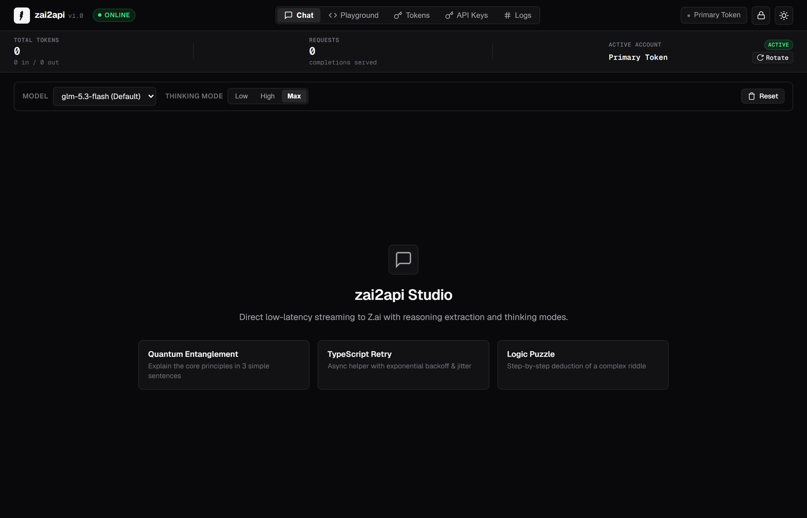
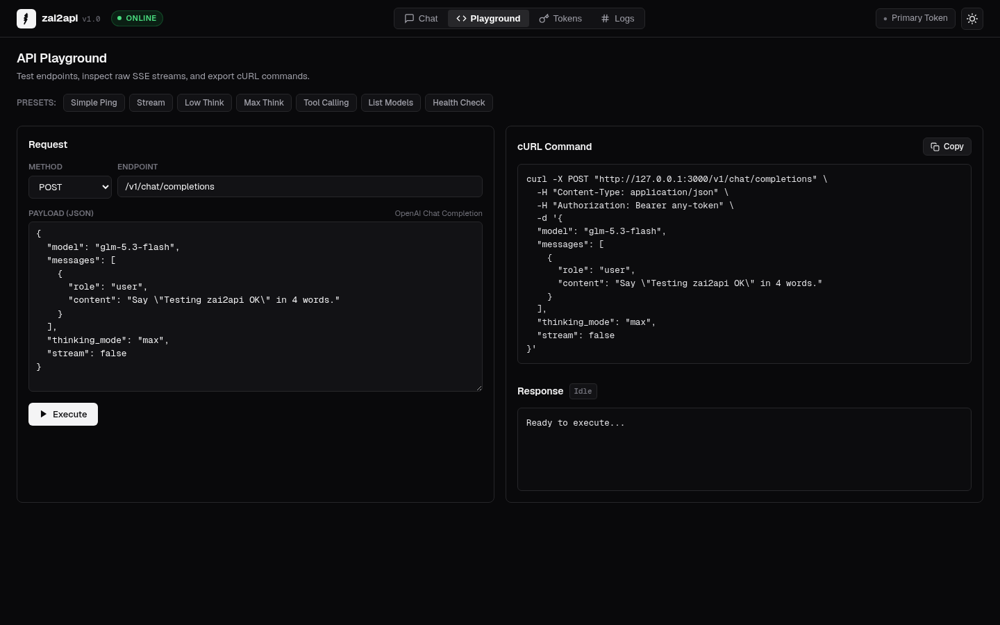
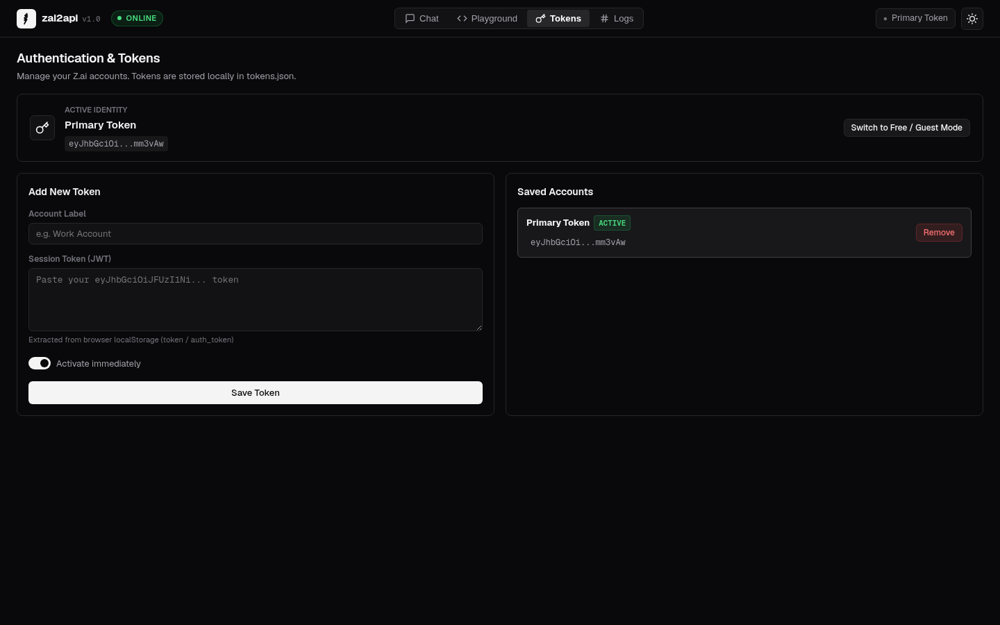

# zai2api

<p align="left">
  <a href="https://nodejs.org/"></a>
  <a href="https://github.com/bchhngsaygez/zai2api"></a>
  <a href="#api-endpoints"></a>
  <a href="#docker-deployment"></a>
  
</p>

High-performance, OpenAI-compatible proxy (`/v1/chat/completions`) for Z.ai web chat (GLM-5.3-Flash / GLM-5.3) powered by stealth browser engines (**CloakBrowser** Chromium by default, optional **Camoufox** Gecko). Engineered for coding agents like Cline and Cursor with DS2API attention-aligned tool calling, low RAM consumption, and zero TLS fingerprinting blocks.

---

## Web Studio Preview

`zai2api` includes a built-in, full-width minimalist dashboard at `http://127.0.0.1:3000` for managing tokens, testing completions, inspecting thought traces, and monitoring live stdout logs.

<p align="center">
  
</p>

| API Playground & cURL Generator | Token Management & Live Logs |
| :---: | :---: |
|  |  |

---

## Key Features

- **OpenAI Compatible**: Drop-in endpoint for `/v1/chat/completions` supporting streaming (`text/event-stream`), non-streaming, and `/v1/models`.
- **Dual Stealth Engine Support**:
  - **CloakBrowser (Default)**: Stealth Chromium with 73 C++ source patches, zero C++ compilation on Windows, lean memory footprint, and native Cloudflare bypass.
  - **Camoufox (Optional)**: Stealth Gecko/Firefox engine for users preferring Firefox emulation (`BROWSER_ENGINE=camoufox`).
- **DS2API Attention-Optimized Tool Calling**:
  - **DSML Protocol**: Formats system prompts and tools into `<|DSML|tool_calls>`, `<|DSML|invoke>`, and `<|DSML|parameter>` aligned with GLM and DeepSeek attention priors.
  - **CDATA Protection**: Uses `<![CDATA[...]]>` for all code, paths, and multiline content to prevent JSON escaping failures, raw newlines, and quote syntax errors.
  - **Array `<item>` Parameter Coercion**: Parses `<item>...</item>` elements automatically into native JavaScript arrays (`commands`, `options`, `files`).
  - **Multi-Turn History Alignment**: In-context tool calls and tool responses in previous conversation turns are re-rendered in aligned DSML to keep model attention intact.
  - **Multi-Format XML Parser & Fallback**: Retains backward-compatibility for canonical `<tool_calls>`, `<tool_call>`, `<editor>`, `<write_to_file>`, and JSON blocks.
  - **Missing Argument & Hallucination Repair**: Resolves file paths from conversation history if omitted by the model; truncates simulated tool results.
- **Route-Based IPC Stream Bridge**: Intercepts SSE stream chunks directly through same-origin routes without relying on brittle console telemetry or global bindings.
- **Token & Session Management**: Seamlessly manage accounts and switch between authenticated tokens or guest mode via the Web Studio dashboard.
- **"Money Saved" Stats Tracking**: Real-time persistent usage statistics (`stats.json`) calculating tokens, requests, and estimated money saved compared to frontier models ($3/1M prompt, $15/1M completion).
- **Thinking Mode**: Supports `low`, `high`, and `max` reasoning efforts, streaming thinking traces via `reasoning_content`.
- **Low RAM Footprint (< 800MB)**: Lean Chromium flags, 16MB memory cache cap, zero-bfcache, and decorative image blocking.
- **Web Studio Dashboard**: Edge-to-edge UI at `http://127.0.0.1:3000` with live stats ribbon, dark/light themes, token management, interactive playground, and live stdout terminal.
- **Docker & Tunnel Ready**: Pre-built Dockerfile and 1-command public tunnel via Cloudflare (`npm run tunnel`).

---

## Quick Start

### 1. Installation

```bash
git clone https://github.com/bchhngsaygez/zai2api.git
cd zai2api
npm install
```

> **Requirement**: Node.js `>= 20.0.0` (Recommended: **Node.js 22 LTS**).
> 
> 💡 **Windows Users**: If using bleeding-edge Node versions (e.g. Node 25) without Visual Studio C++ build tools, `.npmrc` is pre-configured with `ignore-scripts=true` so prebuilt binaries are used without needing `node-gyp rebuild`. Alternatively, run `npm install --ignore-scripts` or switch to **Node.js 22 LTS**.

### 2. Configuration

Copy the sample environment file:
```bash
cp .env.example .env
```

Key environment variables:

| Variable | Default | Description |
| :--- | :---: | :--- |
| `BROWSER_ENGINE` | `cloakbrowser` | Browser engine: `cloakbrowser` (Chromium, default) or `camoufox` (Gecko) |
| `PORT` | `3000` | Server listening port |
| `HOST` | `127.0.0.1` | Host address (`0.0.0.0` for Docker/LAN) |
| `DEFAULT_MODEL` | `glm-5.3-flash` | Default model (`glm-5.3-flash`, `glm-5.3`, `glm-5.2`) |
| `HEADLESS` | `true` | Run browser in headless mode |
| `OPTIMIZE_RAM` | `true` | Low-memory profile (lean Chromium flags, 16MB cache cap) |
| `BLOCK_IMAGES` | `true` | Block image downloads to minimize RAM usage |
| `ZAI_AUTH_TOKEN` | `""` | Optional Z.ai account JWT token (or set via Web UI) |

### 3. Browser Setup & Run Server

CloakBrowser automatically downloads its stealth Chromium binary (~535 MB) on first launch.

```bash
npm start
```

> 💡 **Slow or Unstable Connection?**
> If the initial 535 MB download gets interrupted by your ISP, run our resilient downloader with **automatic HTTP Range resume**:
> ```bash
> npm run download:browser
> ```
> 
> 💡 **Manual Download / IDM**:
> You can also download the zip directly using your browser or download manager:
> - **Windows**: Download [cloakbrowser-windows-x64.zip](https://github.com/CloakHQ/cloakbrowser/releases/download/chromium-v146.0.7680.177.5/cloakbrowser-windows-x64.zip) and extract it to:  
>   `%USERPROFILE%\.cloakbrowser\chromium-146.0.7680.177.5\` (ensure `chrome.exe` is inside).
> - **Linux**: Download [cloakbrowser-linux-x64.tar.gz](https://github.com/CloakHQ/cloakbrowser/releases/download/chromium-v146.0.7680.177.5/cloakbrowser-linux-x64.tar.gz) to `~/.cloakbrowser/chromium-146.0.7680.177.5/`.
> 
> 💡 **Skip Download via Local Chrome/Edge**:
> To start immediately without downloading 535 MB, point `CLOAKBROWSER_BINARY_PATH` in `.env` to your installed browser:
> ```env
> CLOAKBROWSER_BINARY_PATH="C:\Program Files\Google\Chrome\Application\chrome.exe"
> ```

Access the Web Studio at **`http://127.0.0.1:3000`**.

---

## Client Integration

### Cline (VS Code Extension)

1. Open Cline Settings (`Settings` -> `API Provider`).
2. Set **API Provider**: `OpenAI Compatible`
3. Set **Base URL**: `http://127.0.0.1:3000/v1`
4. Set **API Key**: `sk-zai2api` (or any non-empty string)
5. Set **Model ID**: `glm-5.3-flash`
6. Enable **Streaming**.

### Cursor

1. Open Cursor Settings -> **Models** -> **OpenAI API Key**.
2. Override Base URL: `http://127.0.0.1:3000/v1`
3. Add Model: `glm-5.3-flash`

### cURL

```bash
curl http://127.0.0.1:3000/v1/chat/completions \
  -H "Content-Type: application/json" \
  -d '{
    "model": "glm-5.3-flash",
    "messages": [{"role": "user", "content": "Write a quicksort in Rust."}],
    "stream": true
  }'
```

---

## Production Hosting & Deployment

`zai2api` is engineered for 24/7 autonomous operation with ultra-low memory consumption:
- **Idle**: ~533 MB RAM
- **Active Streaming**: ~608 MB RAM
- **Peak Ceiling**: < 750 MB RAM

It runs reliably on any budget cloud VPS ($3–$5/mo on Hetzner, DigitalOcean, Oracle Cloud Free Tier, Linode, AWS Lightsail) or home server.

### Server Requirements
- **OS**: Linux (Ubuntu 22.04/24.04, Debian 12, Alpine) or macOS
- **RAM**: Minimum 1 GB (+ 1-2 GB swap file), Recommended 2 GB
- **CPU**: 1 vCPU or higher
- **Node.js**: `>= 22.0.0` (for bare-metal execution)

---

### Method 1: Docker Compose (Recommended)

The easiest and most isolated production setup with automatic container recovery:

```bash
# 1. Clone repository
git clone https://github.com/bchhngsaygez/zai2api.git
cd zai2api

# 2. Configure environment
cp .env.example .env

# 3. Launch container in background
docker compose up -d --build

# View real-time logs
docker compose logs -f

# Stop container
docker compose down
```

### Method 2: PM2 (Node Process Manager on VPS)

If hosting directly on a Linux VPS without Docker:

```bash
# 1. Install Node 22 & PM2
curl -fsSL https://deb.nodesource.com/setup_22.x | sudo -E bash -
sudo apt install -y nodejs
sudo npm install -g pm2

# 2. Clone & install dependencies
git clone https://github.com/bchhngsaygez/zai2api.git
cd zai2api
npm install

# 3. Start process with memory limit guard
pm2 start src/index.js --name zai2api --max-memory-restart 850M

# 4. Persist across server reboots
pm2 startup
pm2 save
```

### Method 3: Systemd Service (Linux Daemon)

Create a systemd unit file at `/etc/systemd/system/zai2api.service`:

```ini
[Unit]
Description=zai2api OpenAI Proxy Server
After=network.target

[Service]
Type=simple
User=ubuntu
WorkingDirectory=/home/ubuntu/zai2api
ExecStart=/usr/bin/node src/index.js
Restart=always
RestartSec=5
Environment=NODE_ENV=production
Environment=PORT=3000
Environment=HOST=127.0.0.1

[Install]
WantedBy=multi-user.target
```

Enable and start the service:
```bash
sudo systemctl daemon-reload
sudo systemctl enable --now zai2api
sudo systemctl status zai2api
```

---

### Exposing Securely for Remote Access

To connect Cline or Cursor running on your laptop to your remote hosted server:

#### Option A: Cloudflare Tunnel (Zero Open Ports & Free SSL - Recommended)
Exposes port 3000 safely without opening firewall ports, configuring router NAT, or buying SSL certificates:

1. **Temporary Session**:
   ```bash
   npm run tunnel
   ```
2. **Permanent Custom Domain** (e.g. `https://zai.yourdomain.com`):
   ```bash
   # Install cloudflared
   curl -L --output cloudflared.deb https://github.com/cloudflare/cloudflared/releases/latest/download/cloudflared-linux-amd64.deb
   sudo dpkg -i cloudflared.deb

   # Login and create tunnel
   cloudflared tunnel login
   cloudflared tunnel create zai2api
   cloudflared tunnel route dns zai2api zai.yourdomain.com
   ```
   Add to `~/.cloudflared/config.yml`:
   ```yaml
   tunnel: zai2api
   credentials-file: /root/.cloudflared/<tunnel-id>.json
   ingress:
     - hostname: zai.yourdomain.com
       service: http://127.0.0.1:3000
     - service: http_status:404
   ```
   Install system service: `sudo cloudflared service install`.

#### Option B: Nginx Reverse Proxy with Certbot
Forward port 443 with SSE streaming configurations:

```nginx
server {
    server_name zai.yourdomain.com;

    location / {
        proxy_pass http://127.0.0.1:3000;
        proxy_http_version 1.1;
        proxy_set_header Host $host;
        proxy_set_header X-Real-IP $remote_addr;

        # Critical for streaming completions
        proxy_buffering off;
        proxy_cache off;
        proxy_read_timeout 600s;
        proxy_send_timeout 600s;
    }
}
```
Obtain free SSL:
```bash
sudo certbot --nginx -d zai.yourdomain.com
```

#### Option C: Tailscale (Private Mesh Network)
Install Tailscale on both your VPS and your local machine. You can then connect Cline or Cursor to `http://<tailscale-ip>:3000/v1` without exposing any ports to the public internet.

---

## API Endpoints

| Method | Endpoint | Description |
| :--- | :--- | :--- |
| `POST` | `/v1/chat/completions` | OpenAI Chat Completions (streaming, tools, reasoning) |
| `GET` | `/v1/models` | Lists available models |
| `GET` | `/v1/stats` | Cumulative tokens, requests, and cost savings (`/api/stats`) |
| `POST` | `/api/stats/reset` | Resets usage and savings metrics |
| `GET` | `/v1/tokens` | Lists configured auth tokens and cooldown statuses |
| `POST` | `/v1/tokens` | Adds a new auth token |
| `POST` | `/api/tokens/rotate` | Manually rotate active token to next available |
| `POST` | `/api/tokens/clear-cooldowns` | Clears all active token cooldown timers |
| `DELETE`| `/v1/tokens/:id` | Deletes an auth token |
| `POST` | `/v1/tokens/:id/activate` | Sets active auth token |
| `GET` | `/v1/queue/status` | Current request queue state |
| `POST` | `/v1/subagent/task` | Multi-file subagent code generator |
| `GET` | `/health` | Health check endpoint |

---

## Troubleshooting

- **`EADDRINUSE: address already in use`**: Another instance of `zai2api` is already running on port 3000. Run:
  ```bash
  pkill -f "node src/index.js"
  ```
- **Browser profile locked**: Stale browser processes or crash locks detected. Stop running instances:
  ```bash
  pkill -f "node src/index.js"
  pkill -f cloak
  pkill -f chrome
  pkill -f camoufox
  # Remove Chromium locks
  rm -f user-data-cloak/SingletonLock user-data-cloak/SingletonSocket user-data-cloak/SingletonCookie
  # Remove Firefox locks (if using Camoufox)
  rm -f user-data-camoufox/lock user-data-camoufox/.parentlock
  ```
- **npm install peer dependency warnings**: `.npmrc` is pre-configured with `legacy-peer-deps=true` and `ignore-scripts=true`. Simply run `npm install` directly without `--force`.

---

## License

MIT
